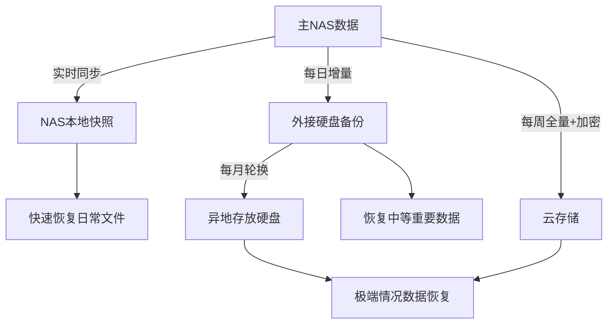

# 家庭 NAS 数据备份完整指南

> 面向 NAS 爱好者，全面介绍在家庭环境中如何规划与实施高效、安全的数据备份方案，避免数据丢失、误删、硬盘故障等意外带来的损失。

---

## 📌 为什么备份很重要？

* 硬盘寿命有限，随时可能损坏（尤其是非企业级硬盘）
* 误删或操作失误
* 软件/病毒/勒索攻击
* 家庭灾害（如火灾、水灾、雷击）

!!! warning "常见误区"
    - RAID 不是备份，只是冗余。真正的备份需要独立副本，最好异地保存。（RAID防止硬件故障，但无法应对误删、勒索病毒）
    - 同一路由器下的设备不算异地备份（断电或网络攻击可能同时影响）
    - 不验证备份有效性等于没有备份
---

## 🧠 核心备份原则：3-2-1 法则

| 备份规则 | 说明                  |
| ---- | ------------------- |
| 3    | 至少保留三份数据（原始 + 两份副本） |
| 2    | 使用两种不同的存储介质（如硬盘+云盘） |
| 1    | 至少有一份保存在异地          |

---

## 🏗️ 混合备份架构示例

适合大多数家庭的黄金组合方案：

---

## 🔧 推荐备份工具

### 🔹 本地同步工具

* **rsync**：类 Unix 系统的经典命令行同步工具
* **Syncthing**：去中心化同步，非常适合多设备之间自动同步
* **FreeFileSync**：GUI 工具，适合 Windows/Mac

### 🔹 云同步与加密备份

* **Rclone**：支持 Google Drive、OneDrive、Dropbox、S3 等，支持加密与挂载
* **Duplicacy / Restic / Borg**：高效压缩+加密+版本管理的 CLI 工具
* **Synology Hyper Backup**：群晖专用，支持多版本 + 加密 + 云端同步

---

## 🗂️ 重要数据分类与备份建议

| 数据类型              | 建议策略                                   |
| ----------------- | -------------------------------------- |
| 家庭照片、视频           | 原图保存在 NAS，压缩图用于共享；至少冷备一份（USB 或云端）      |
| 文档资料              | 存 NAS + 云同步（如 OneDrive / Google Drive） |
| 多媒体库              | 可用 RAID 或重复下载，必要时冷备（因体积大）              |
| 重要配置文件            | Git 管理 + 云端同步或脚本自动备份                   |
| 数据库（如 PostgreSQL） | 每日自动导出 + 本地/云端冷备份                      |

---

## 🔐 安全建议

* 启用加密备份（尤其是上传到云端时）
* 使用只读挂载的冷备硬盘防止误删
* 云端账号开启 2FA（两步验证）
* 定期恢复测试（检查备份可用性）
* 禁止非必要外网访问备份路径

---

## ⏱️ 自动化备份示例

### 使用 `cron` 定时运行 Rclone 同步到云端：

```bash
0 2 * * * /usr/bin/rclone sync /mnt/nas/documents gdrive:/nas-backup/documents --log-file=/var/log/rclone.log
```

### 使用 `duplicacy` 自动备份并上传加密副本：

```bash
duplicacy backup -storage gdrive -stats
```

---

## 📦 Docker 备份工具容器推荐

| 容器                        | 功能                  |
| ------------------------- | ------------------- |
| `duplicacy/duplicacy-web` | Web UI 备份工具，支持多目标同步 |
| `restic/rest-server`      | 自建远程备份服务            |
| `crazymax/diun`           | 镜像更新通知（防止失效版本被覆盖）   |
| `linuxserver/rsync`       | 容器内文件同步服务           |

---
# 常见 NAS 数据备份工具对比表

> 以下是为家庭 NAS 用户准备的数据备份工具推荐与对比，涵盖本地、异地、云端备份方案。

| 工具名称           | 类型        | 特点/优点                               | 缺点/限制                             | 是否支持加密  | 是否支持增量备份  | 适合场景                      |
| -------------- | --------- | ----------------------------------- | --------------------------------- | ------- | --------- | ------------------------- |
| **rsync**      | 本地/远程     | - 跨主机同步<br>- 支持排除规则<br>- 稳定成熟       | - 配置较繁琐<br>- 无图形界面                | 否       | ✅         | 本地/局域网/异地备份               |
| **rclone**     | 云端        | - 支持众多云服务<br>- 命令行功能强大              | - 无实时同步<br>- 初学者配置较复杂             | ✅       | ✅         | 备份到 OneDrive/Google Drive |
| **Duplicati**  | 云端/本地     | - 支持图形界面<br>- 支持多种云<br>- 加密压缩       | - 较依赖 Mono 环境（Linux）<br>- 容器部署略复杂 | ✅       | ✅         | 图形化用户，云端/本地备份             |
| **Restic**     | 本地/远程/云   | - 支持 S3/B2/FTP 等<br>- 配置简单<br>- 跨平台 | - 无 GUI<br>- 恢复步骤需熟悉              | ✅       | ✅         | 通用备份方案，轻量需求               |
| **Syncthing**  | 实时同步      | - 端到端同步<br>- 自动发现节点<br>- 开源安全       | - 非严格“备份”，而是“同步”                  | 否       | ⚠️（非传统备份） | 多设备之间实时同步文件               |
| **Timeshift**  | 本地（Linux） | - 快照系统级别变更<br>- Btrfs 支持            | - 非数据备份<br>- 不支持异地/云              | ✅（系统快照） | ✅         | Linux 系统配置快照回滚            |
| **BorgBackup** | 本地/远程     | - 高效去重<br>- 安全加密<br>- CLI 简洁        | - 学习曲线略高<br>- 无 GUI               | ✅       | ✅         | 高级用户，版本控制需求强              |
| **ZFS Snap**   | 本地        | - 高速本地快照<br>- 可用于定期备份               | - 需使用 ZFS 文件系统                    | ⚠️ 依配置  | ✅         | 使用 ZFS 构建时间点快照备份          |

---

## 📝 推荐搭配组合

* **基础方案（适合大多数人）**：`rsync` + `rclone` → 本地 + 云端手动备份
* **图形化方案（低门槛）**：`Duplicati` 或 `UrBackup`
* **极致安全方案（技术党）**：`BorgBackup` 或 `Restic` + 加密 + 多目标

如需自动化脚本、定时备份策略或实际部署示例，可继续向我提出需求 😄

## 🧩 备份实战 Tips

* 使用标签管理备份集（如：照片、代码、配置、视频）
* 为大文件使用分块上传工具（如 Rclone 的 chunk 模式）
* 冷备盘应定期手动连接并同步后断开
* 将关键系统配置（如 docker-compose.yaml）也作为备份对象

---

## ✅ 总结

* 🧠 建立 3-2-1 备份体系：本地 + 云端 + 冷备
* 🔒 注重加密与权限管理
* 🔁 自动化是关键，减少人工操作失误
* 📅 每季度至少检查一次备份有效性

> 数据只有在恢复成功时才算真正备份成功。

---

## 📚 延伸阅读

* [Rclone 官网](https://rclone.org/)
* [Duplicacy 官网](https://duplicacy.com/)
* [Restic 文档](https://restic.readthedocs.io/)
* [群晖 Hyper Backup 使用指南](https://kb.synology.cn/zh-cn/DSM/help/DSM/Backup/backup_hyperbackup)

---

记住，备份不是一次性设置，而是需要持续维护和优化的系统工程。定期检查、测试和更新你的备份策略，确保在真正需要时能够快速可靠地恢复数据。

> _备份是底线：保证最坏情况下“数据还在”_
