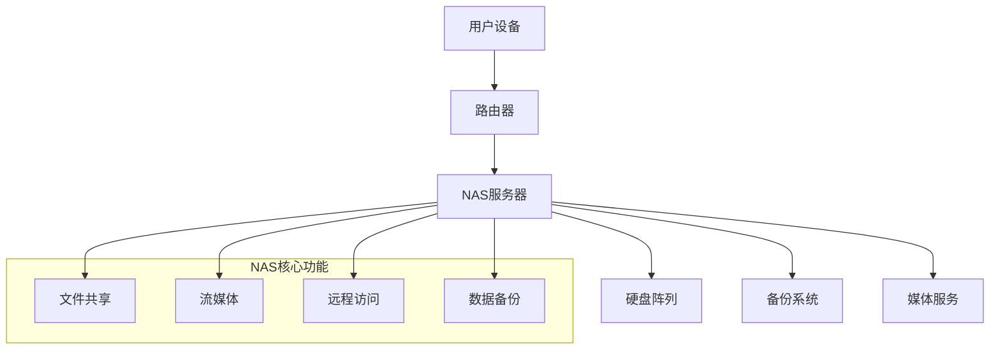

# 欢迎来到 NAS 世界 🚀

  
*你的个人云端服务器*

---

## 🌐 什么是 NAS？
**网络附加存储（Network Attached Storage, NAS）** 是一种通过网络连接的专用存储设备，允许用户集中管理文件、备份数据、流媒体播放，并运行各种应用程序。它是家庭/企业数字化生活的基石。

---

## 🔧 核心优势

- **集中存储**：统一管理照片、视频、文档等文件  
- **远程访问**：随时随地访问个人云盘  
- **自动化备份**：保护重要数据免受意外  
- **多设备同步**：手机、电脑、电视无缝协作  
- **扩展性强**：支持 Docker 容器、虚拟机、数据库等  

---

## 🏠 应用场景

### 1. **家庭媒体中心**
- 搭建 Plex/Emby/Jellyfin 服务器，打造私人影院  
- 自动整理电影、电视剧、音乐库  

### 2. **文件共享与协作**
- 通过 Nextcloud/Seafile 实现团队文件共享  
- 支持版本控制与权限管理  

### 3. **数据备份与恢复**
- 自动备份手机照片、电脑文件  
- 防御勒索病毒与硬件故障  

### 4. **自动化任务中心**
- 运行 Home Assistant 家庭自动化  
- 使用 Watchtower 自动更新容器应用  

---

## 💡 为什么选择NAS？

!!! tip "核心优势"
    - **随时随地访问** - 通过网络在任何地方访问您的数据
    - **数据安全** - 支持RAID冗余和定期备份
    - **媒体服务器** - 流媒体播放音乐、视频和照片
    - **成本效益** - 相比云存储，长期使用更经济

---

## 🛠️ 系统架构

